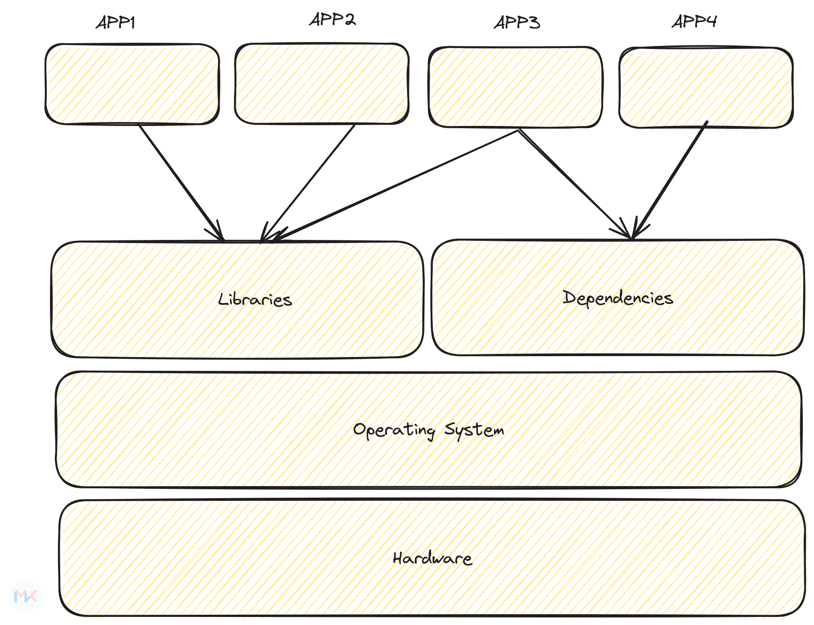

# Introduction to Docker


> Docker is an open platform for developing, shipping, and running applications. Docker enables you to separate your applications from your infrastructure so you can deliver software quickly.

Docker is an open-source platform that automates the deployment, scaling, and management of applications inside lightweight, portable containers. Containers are standalone, executable packages that include everything needed to run a piece of software, including the code, runtime, libraries, and system tools. Docker uses containerization technology to encapsulate applications and their dependencies in a consistent and reproducible environment.


## Matrix of hell

The "Matrix of Hell" problem refers to the challenges and complexities that arise when trying to manage and deploy software across different environments, such as development, testing, and production. Docker addresses this problem through containerization, providing a standardized and isolated environment for applications.


To understand the matrix of hell, let us understand the following example, where we have two applications - `max-hell-python-2.py` and `max-hell-python-3.py`, which are dependent on `Python 2.7` and `Python ~ 3.0` respectively.


## Solving the "Matrix of Hell" Problem:


- Isolation: Docker containers encapsulate applications and their dependencies, ensuring that they run consistently- across various environments. This eliminates the "it works on my machine" issue, where code behaves differently on- different machines.
- Portability: Docker containers are lightweight and can run on any system that supports Docker. This allows developers- to create applications in a consistent environment and deploy them seamlessly across different platforms, reducing- compatibility issues.
- Versioning and Reproducibility: Docker allows you to version your containers, making it easy to roll back to a previous- state if needed. With Dockerfiles, you can define the environment and dependencies, ensuring that the application's- setup is reproducible.
- Resource Efficiency: Docker containers share the host OS kernel, making them more resource-efficient compared to- traditional virtualization. This enables running multiple containers on a single host without the overhead of multiple- oper
ating systems.
- DevOps Practices: Docker facilitates DevOps practices by promoting collaboration between development and operations- teams. It simplifies the deployment process, making it easier to integrate continuous integration and continuous- deployment (CI/CD) pipelines.


## Docker architecture


## Docker Components

Docker consists of several key components that work together to enable containerization and management of applications.

Verify the details with the `docker info` command


```bash
Client: Docker Engine - Community  # <------------Docker client
 Version:    24.0.7
 Context:    default
 Debug Mode: false
 Plugins:
  buildx: Docker Buildx (Docker Inc.)
    Version:  v0.11.2
    Path:     /usr/libexec/docker/cli-plugins/docker-buildx
  compose: Docker Compose (Docker Inc.)
    Version:  v2.21.0
    Path:     /usr/libexec/docker/cli-plugins/docker-compose

Server: # <------------Docker daemon
 Containers: 4
  Running: 0
  Paused: 0
  Stopped: 4
 Images: 2
 Server Version: 24.0.7
 Storage Driver: overlay2
  Backing Filesystem: extfs
  Supports d_type: true
  Using metacopy: false
  Native Overlay Diff: true
  userxattr: false
 Logging Driver: json-file
 Cgroup Driver: systemd # <----------- Cgroup driver
 Cgroup Version: 2
 Plugins:
  Volume: local
  Network: bridge host ipvlan macvlan null overlay
  Log: awslogs fluentd gcplogs gelf journald json-file local logentries splunk syslog
 Swarm: inactive # <----------- Swarm status
 Runtimes: io.containerd.runc.v2 runc # <----------- Runtimes
 Default Runtime: runc # <----------- default runtime
 Init Binary: docker-init
 containerd version: 3dd1e886e55dd695541fdcd67420c2888645a495
 runc version: v1.1.10-0-g18a0cb0
 init version: de40ad0
 Security Options:
  apparmor
  seccomp
   Profile: builtin
  cgroupns
 Kernel Version: 6.5.0-14-generic
 Operating System: Ubuntu 23.10
 OSType: linux
 Architecture: x86_64
 CPUs: 8
 Total Memory: 15.18GiB
 Name: mohit-NUC11TNHi7
 ID: c096087d-a8c5-4505-9512-be3e8bc28f5f
 Docker Root Dir: /var/lib/docker
 Debug Mode: false
 Experimental: false
 Insecure Registries:
  127.0.0.0/8
 Live Restore Enabled: false

```


### Docker Daemon

The Docker daemon (`dockerd`) is a background process responsible for managing Docker containers on a system. It listens for Docker API requests and communicates with the Docker CLI (Command Line Interface) to execute commands.

```bash
$ ps -ef | grep -i docker
root       43787       1  0 13:48 ?        00:00:00 /usr/bin/dockerd -H fd:// --containerd=/run/containerd/containerd.sock
```
### Docker Client

The Docker client (`docker`) is the primary interface through which users interact with Docker. It sends commands to the Docker daemon to build, run, and manage containers. The client can communicate with a local daemon or a remote daemon.

```bash
$ docker ps -a

CONTAINER ID   IMAGE      COMMAND                  CREATED         STATUS                     PORTS     NAMES
173fbf13ccdc   python:3   "python /usr/src/app…"   6 minutes ago   Exited (2) 6 minutes ago             angry_blackburn
6c536e8a6cfc   python:3   "python /usr/src/app…"   6 minutes ago   Exited (2) 6 minutes ago             zealous_elbakyan
d64b7ce8e205   python:3   "python /usr/src/app…"   6 minutes ago   Exited (2) 6 minutes ago             infallible_cray
112017a63803   python:2   "python max-hell-pyt…"   7 minutes ago   Exited (2) 7 minutes ago             quirky_shamir

```

### Docker Images

Docker images are lightweight, standalone, and executable packages that include the application code, runtime, libraries, and dependencies. Images serve as the basis for creating containers. They are often stored in registries, such as Docker Hub, for easy sharing and distribution.

### Docker Containers

A Docker container is a running instance of a Docker image. Containers encapsulate the application and its dependencies, providing isolation and consistency across different environments. Containers can be started, stopped, and deleted, offering a scalable and flexible approach to application deployment.

### Docker Compose

Docker Compose is a tool for defining and managing multi-container Docker applications. It allows you to define the services, networks, and volumes in a `docker-compose.yml` file, simplifying the process of running and scaling complex applications.

### Docker Registry

A Docker registry is a centralized repository for storing and distributing Docker images. Docker Hub is the default public registry, but organizations often set up private registries for proprietary or sensitive images.

### Dockerfile

A Dockerfile is a script containing instructions for building a Docker image. It specifies the base image, adds dependencies, sets environment variables, and defines commands to be executed during the image build process. Dockerfiles enable the creation of reproducible and version-controlled images.

### Docker Volumes

Docker volumes provide a way to persist data generated by containers. They enable data sharing between containers and allow for data persistence beyond the container's lifecycle. Volumes are crucial for handling data in stateful applications.

 

### References:

- [Docker Documentation](https://docs.docker.com/)
- [Docker - Wikipedia](https://en.wikipedia.org/wiki/Docker_(software))
- [Docker: The Matrix, Antipatterns, and Best Practices](https://www.docker.com/blog/docker-the-matrix-antipatterns-and-best-practices/)
- [What is Docker?](https://opensource.com/resources/what-docker)